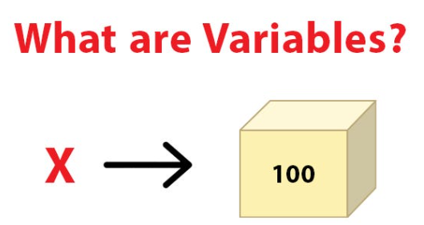

# 🌟 My Data Science Journey

Tracking my daily progress in Data Science.

---

## 📅 Day-wise Log
### ✅ Day 1: Intro to Python
### About **Python**
- Python is a powerful, high-level, general-purpose programming language. It's known for its *simplicity*, *readability*, and *versatility*

### 🔹 `Why Python?`
- Easy to learn & read: Clean syntax similar to English.

- Huge community support

- Rich libraries: NumPy, Pandas, Matplotlib, Scikit-learn, TensorFlow, etc.

- Versatile: Used in web development, data science, AI/ML, automation, scripting, etc.
### 📘 Learned basic syntax, variables, data types
###  Rules for Writing Variables in Python
- Variable names must start with a letter (a-z, A-Z) or an underscore _

- The rest of the name can include letters, digits (0–9), or underscores

- Case-sensitive: Name and name are different

- Cannot use Python keywords (like if, class, for, etc.)

- Avoid special characters like @, $, %, etc.

- Should be descriptive (e.g., age, total_amount)

- No spaces allowed — use underscore instead (e.g., user_name)

### 📚 Built-in Data Types in Python
####              📌 Basic Types
- int – Integer (e.g., x = 10)

- float – Floating-point number (e.g., pi = 3.14)

- bool – Boolean (e.g., is_valid = True)

- str – String (e.g., name = "Alice")

#### 📌 Collection Types
- list – Ordered, mutable (e.g., items = [1, 2, 3])

- tuple – Ordered, immutable (e.g., point = (2, 5))

- set – Unordered, unique items (e.g., ids = {1, 2, 3})

- dict – Key-value pairs (e.g., person = {"name": "Bob"})
 🔗 [View Code](Day1/code.ipynb)
  
  
